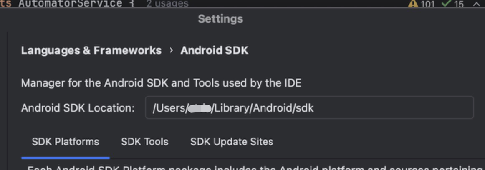

Set up Android SDK Environment with Android studio
========================================================

.. note:: 
    **Prerequisite:** Android Studio installed on your PC.

    Your can download Android studio in https://developer.android.com/studio.

.. tip:: 
    Kea relies on ``adb`` cmd to interact with android devices. The key is to make the ADB(Android Debug Bridge) cmd available.
    The following tutorial will help you setup the whole suite of Android sdk tools. But remember, add the ``adb`` cmd to path is enough for kea.

MacOS and Linux
~~~~~~~~~~~~~~~~~~~~~~~~~~~~~~~

Setup cmdline tools (adb)
-------------------------------

See `Android studio doc: Environment variables <https://developer.android.com/tools/variables>`_ for details.

If you're using zsh, bash. Setup the ``ANDROID_HOME`` environment with ``EXPORT`` cmd. The ``ANDROID_HOME`` 
environment should refer to your sdk installation path. The default path is ``/usr/Library/Android/sdk/``. You
can check your installation path in Android Studio via :guilabel:`Android Studio` -> :guilabel:`Settings` -> :guilabel:`Language & Frameworks` -> :guilabel:`Android SDK`

    The sample of Android sdk path in Android Studio

Then, add the path in the .bashrc or .zshrc file.

.. code:: bash

    EXPORT ANDROID_HOME="/usr/.../Library/Android/sdk/"
    # Export all the cmd in the library.

``source`` the file to activate the modification.

.. important::
    Enter ``adb`` in your terminal to check if the setup succeed.

Run the emulator
------------------------
Run an Android emulator through Android Studio. Follow the following tutorial to create and run an emulator.

`Andorid Studio docs - Create and Manager Virtual devices <https://developer.android.com/studio/run/managing-avds>`_

.. important:: 
    Run ``adb devices`` in your terminal. You should see your emulator being listed.

Windows
~~~~~~~~~~~~~~~~~~~~~~~~~~~~~~~~
