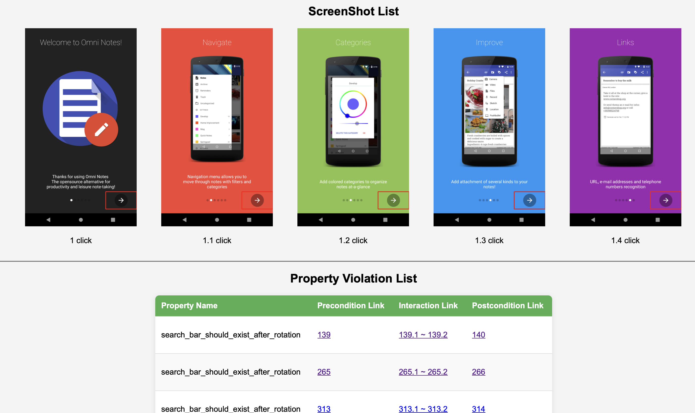

Bug Report
=======================

|

The above image is a bug report of Omninotes, it's search bar disappeared after the user rotate the screen.
So it violate the ``search_bar_should_exist_after_rotation`` property.

After the testing, You can see a ``bug_report.html`` in the output folder under your output path.
The line at the top of the report record the screenshot of every states during the testing process.
The table below shows a property violation list, it contains ``precondition link``, ``interaction link`` and ``postcondition link`` of
every property violation situation. Click the link will jump to the corresponding screenshots,
to help you understand what happened at that moment.