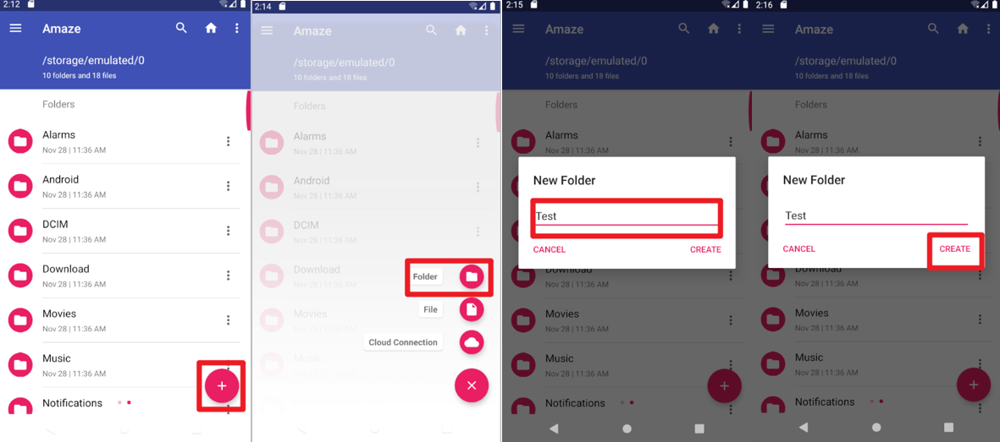
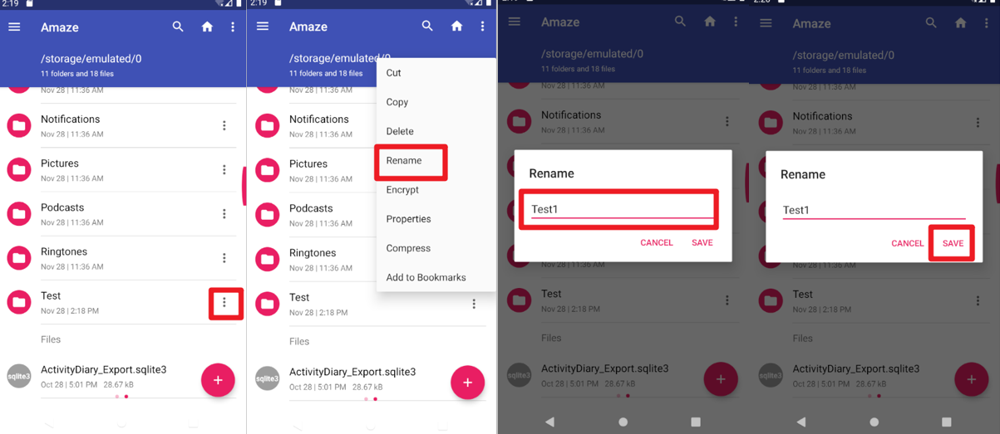
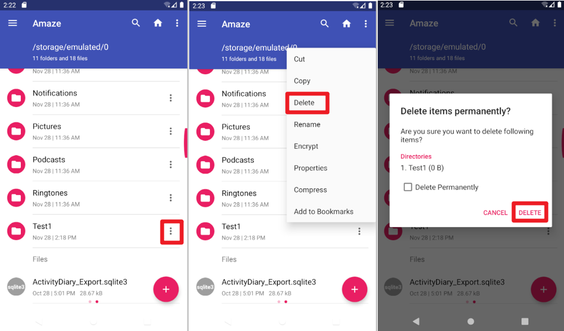

Stateful Testing
========================

“Hint” 在英语中通常指的是一个提示、暗示或线索，用来帮助人们理解、解决问题或做出决定。它可以用于多种场合，比如：

教育和学习：在学习过程中，老师可能会给学生一些“hints”来帮助他们解决难题，而不是直接给出答案。

游戏：在视频游戏中，玩家可能会收到“hints”来帮助他们找到隐藏的物品或完成任务。

编程：在编程中，某些工具或IDE会提供“hints”来帮助开发者理解代码或使用特定的功能。

示例
In a sentence: "The teacher gave the students a hint to help them solve the math problem."
In a game: "If you get stuck, you can use a hint to find out where to go next."
总的来说，“hint” 是一种非直接的指导，旨在引导人们思考或发现答案。

vscode设置自动保存

在 Visual Studio Code (VSCode) 中设置自动保存非常简单。以下是步骤：

打开设置：

可以通过点击左下角的齿轮图标（⚙️），然后选择“Settings”。
或者使用快捷键 Ctrl + ,（Windows/Linux）或 Cmd + ,（macOS）。
搜索自动保存：

在设置搜索框中输入 auto save。
选择自动保存选项：

在“Files: Auto Save”选项中，你可以选择以下几种模式：
off: 关闭自动保存。
afterDelay: 在一定延迟后自动保存（默认延迟为 1000 毫秒，可以在设置中调整）。
onWindowChange: 当窗口失去焦点时自动保存。
onWindowChange: 当窗口失去焦点时自动保存。
onWindowChange: 当窗口失去焦点时自动保存。
保存设置：

设置会自动保存，无需额外操作。
示例
如果你选择 afterDelay，VSCode 将在你停止输入后自动保存文件。你可以根据需要调整延迟时间。

这样，你就可以在 VSCode 中轻松设置自动保存功能了！

resourceId是一个选择器吗

在不同的上下文中，“resourceId”可能有不同的含义，但通常它并不是一个选择器，而是一个标识符，用于唯一标识某个资源。以下是一些常见的用法：

在云计算中：在云服务（如 AWS、Azure 或 Google Cloud）中，resourceId 通常用于唯一标识某个特定的资源（如虚拟机、存储桶、数据库等）。它是一个字符串，通常包含服务名称、区域、账户信息等。

在 API 中：在 RESTful API 中，resourceId 可能作为请求的一部分，用于指定要操作的特定资源。例如，获取某个用户的信息时，可能会使用 /users/{resourceId} 的形式。

在编程中：在某些编程环境中，resourceId 可能用于标识特定的资源对象，例如在图形用户界面（GUI）开发中标识控件或组件。

选择器的区别
选择器：通常指的是在 CSS、JavaScript 或其他上下文中用于选择 DOM 元素的字符串（如 .className、#id 等）。
resourceId：是用于标识资源的唯一字符串，而非用于选择 DOM 元素的选择器。
如果你有特定的上下文或示例，欢迎提供更多信息，我可以给出更详细的解释！

移动应用里

在移动应用开发中，resourceId 通常指的是用于标识特定资源（如视图、布局、图像等）的唯一标识符。这个概念在 Android 和 iOS 开发中都有应用，但具体实现和用法有所不同。

Android
在 Android 开发中，resourceId 是指在 res 目录下定义的资源的唯一标识符。每个资源（如布局文件、字符串、图像等）都有一个对应的 resourceId，通常在代码中以 R 类的形式访问。例如：

int resourceId = R.layout.activity_main; // 访问布局资源
iOS
在 iOS 开发中，虽然没有直接称为 resourceId 的概念，但类似的标识符用于访问资源。例如，使用 UIImage 或 NSBundle 来加载资源：

let image = UIImage(named: "myImage") // 加载图像资源
选择器的区别
在移动应用开发中，选择器通常指的是用于选择 UI 元素的标识符。例如，在 Android 中，可以使用 findViewById 方法通过资源 ID 选择视图。在 iOS 中，可以使用 IBOutlet 来连接 UI 元素。

总结
因此，resourceId 在移动应用中通常是一个标识符，用于唯一标识资源，而不是选择器。选择器是用于选择和操作 UI 元素的工具。希望这能帮助你理解它们之间的区别！如果你有更具体的上下文或问题，欢迎继续讨论！

Select the widget that has text "Clock" and className "android.widget.TextView" and click it.

To select a widget with the text "Clock" and the class name "android.widget.TextView" in an Android application and perform a click action on it, you can use the following approaches depending on the testing framework or automation tool you are using. Here are examples for both UI Automator and Appium:

Using UI Automator
If you're using UI Automator in an Android testing context, you can write a test like this:

UiDevice device = UiDevice.getInstance(InstrumentationRegistry.getInstrumentation());
UiObject clockTextView = device.findObject(new UiSelector()
        .text("Clock")
        .className("android.widget.TextView"));

if (clockTextView.exists()) {
    clockTextView.click();
}
Using Appium
If you're using Appium for mobile automation, you can select the widget and click it using the following code:

from appium import webdriver

# Assuming you have already set up the Appium driver
driver = webdriver.Remote('http://localhost:4723/wd/hub', desired_capabilities)

# Locate the TextView with text "Clock"
clock_element = driver.find_element_by_android_uiautomator('new UiSelector().text("Clock").className("android.widget.TextView")')

# Click the element
clock_element.click()
Explanation
UI Automator: This framework allows you to interact with the UI components of your app. The UiSelector() method is used to find the specific widget based on its properties (text and class name).

Appium: This is a cross-platform mobile application testing framework that allows you to write tests in various programming languages. The find_element_by_android_uiautomator method is used to locate the widget based on UI Automator selectors.

Note
Make sure that the app is in a state where the "Clock" TextView is visible and can be interacted with. If the element is not found or not clickable, you may need to add waits or ensure the app is in the correct state.

介绍一下stateful testing

Stateful Testing 是一种软件测试方法，特别适用于具有状态的应用程序或系统。在这种测试方法中，测试的重点是系统在不同状态下的行为和响应。这种方法通常用于需要保持上下文或状态的应用程序，比如用户界面、数据库应用程序和网络协议等。

主要特点
状态管理：

在 stateful testing 中，测试人员需要关注系统的当前状态。例如，在一个电子商务应用中，用户的购物车状态、登录状态等都会影响后续操作的结果。
状态转移：

测试不仅关注单一状态的行为，还关注从一个状态转移到另一个状态时的行为。这可能涉及多个操作的组合，例如从未登录状态到登录状态，再到购物车状态。
复杂性：

由于状态的多样性和转移的复杂性，stateful testing 可能会比无状态测试更复杂。测试人员需要设计测试用例以覆盖不同的状态和状态之间的转移。
用例设计：

测试用例通常基于状态图或状态转移图，这些图示帮助测试人员理解系统的不同状态及其转换。
示例
考虑一个在线银行应用程序：

状态：

用户未登录
用户已登录
用户在查看账户信息
用户在进行转账操作
测试场景：

从未登录状态尝试进行转账操作（应返回错误）。
登录后，查看账户信息，然后进行转账操作（应成功）。
在转账过程中，切换到查看账户信息，确保转账状态保持正确。
优势
提高测试覆盖率：通过关注状态和状态转移，可以更全面地测试系统的行为。
发现潜在缺陷：许多缺陷可能仅在特定状态下显现，stateful testing 有助于揭示这些问题。
总结
Stateful Testing 是一种重要的测试策略，适用于需要考虑状态和状态转移的应用程序。通过这种方法，测试人员可以确保软件在各种状态下的行为符合预期，从而提高软件的可靠性和用户体验。

一段话介绍原理和应用

Stateful Testing 是一种测试方法，专注于系统在不同状态下的行为和响应。其原理基于状态管理和状态转移，通过设计测试用例来覆盖各种状态及其转换，以确保系统在不同条件下的正确性和一致性。此方法广泛应用于需要保持上下文的应用程序，如电子商务、在线银行和游戏等，能够有效发现潜在缺陷，提高软件的可靠性和用户体验。

带状态的测试是一种软件测试方法，专注于系统在不同状态下的行为和响应。
其原理基于状态管理和状态转移，通过设计测试用例来覆盖各种状态及其转换，以确保系统在不同条件下的正确性和一致性。
此方法适合应用于需要保持状态前后一致的应用程序，过设计带状态的测试用例，
确保系统在各种状态下正常运行，从而增强软件的可靠性和用户体验。

翻译成英文

Stateful testing is a software testing method that focuses on the behavior and responses of
a system in different states. Its principles are based on state management and state transitions,
designing test cases to cover various states and their transitions to ensure the correctness and
consistency of the system under different conditions. This method is suitable for applications that
require maintaining state consistency, and by designing stateful test cases,
it ensures that the system operates correctly in various states,
thereby enhancing the reliability of the software and the user experience.

In mobile apps, some functionalities can move from one state to another state based on certain inputs or actions.
Thus, it need additional data structure to support this.

| Here Kea refers to `Hypothesis's Stateful Testing <https://hypothesis.readthedocs.io/en/latest/stateful.html>`_.

In Kea, you can use stateful testing when you write some properties that require stateful information.
Just like following codes, when you want to manipulate files or folders on devices, such us create a file, delete a file or rename the file.
You can write codes like this:

.. code:: Python

    _files = Kea.Bundle("files")

The Bundle class contains the following functions:

* add(value: str)

Add a new value to the current Bundle object.

.. code-block:: Python

    self._files.add(file_name)

* delete(value: str)

Delete a value from the current Bundle object.

.. code-block:: Python

    self._files.delete(selected_file_name)

* update(value: str, new_value: str)

Update the value from ``value`` to ``new_value``

.. code-block:: Python

    self._files.update(file_name, new_name)

* get_all_data()

This function will return a list of values of current Bundle object.

.. code-block:: Python

    self._files.get_all_data()

* get_random_value(value_len: int = 10)

This function will randomly generate a value and return. So you can call it before using the ``add`` and ``update`` function.

.. code-block:: Python

    file_name = self._files.get_random_value()
    self._files.add(file_name)

* get_random_data()

This function will randomly select a value from the existing values in the current Bundle object.
So you can call it before using the ``delete`` and ``update`` function.

.. code-block:: Python

    file_name = self._files.get_random_data()
    self._files.delete(selected_file_name)

Here is a complete example to show how to use Kea's stateful testing when you define property.
This example will show how to use stateful testing in the app `Amaze <https://github.com/TeamAmaze/AmazeFileManager>`_, it is a file management app,
allows users to manipulate files or folders on devices. These properties are defined for testing whether data manipulation of
the file system have some errors. Stateful testing is essential in this situation, you can use stateful testing to store all the folders created by Kea,
and can manipulate them along the whole testing process.

Firstly, you can define a ``create_file_should_exist`` property. Just return to the home directory, create a file and check whether the new file is exist.

|

.. code-block:: Python

        @precondition(lambda self: d(resourceId="com.amaze.filemanager:id/sd_main_fab").exists() and
                                   not d(textContains = "SDCARD").exists())
        @rule()
        def create_file_should_exist(self):
            d.swipe_ext("down", scale=0.9)
            d(description="Navigate up").click()
            d(resourceId="com.amaze.filemanager:id/design_menu_item_text", textContains="Internal Storage").click()
            d(resourceId="com.amaze.filemanager:id/sd_main_fab").click()
            d(resourceId="com.amaze.filemanager:id/sd_label", text="Folder").click()
            file_name = self._files.get_random_value()
            d.send_keys(file_name, clear=True)
            d(resourceId="com.amaze.filemanager:id/md_buttonDefaultPositive").click()
            self._files.add(file_name)
            d(scrollable=True).scroll.to(resourceId="com.amaze.filemanager:id/firstline", text=file_name)
            assert d(text=file_name).exists()

Secondly, you can define a ``change_filename_should_follow`` property. Just return to the home directory, choose a file change its name and check whether the file is changed.

|

.. code-block:: Python

        @precondition(lambda self: self._files.get_all_data() and
                                    d(resourceId="com.amaze.filemanager:id/sd_main_fab").exists() and
                                    not d(resourceId="com.amaze.filemanager:id/action_mode_close_button").exists())
        @rule()
        def change_filename_should_follow(self):
            d.swipe_ext("down", scale=0.9)
            d(description="Navigate up").click()
            d(resourceId="com.amaze.filemanager:id/design_menu_item_text", textContains="Internal Storage").click()
            file_name = self._files.get_random_data()
            new_name = self._files.get_random_value()
            d(scrollable=True).scroll.to(resourceId="com.amaze.filemanager:id/firstline", text=file_name)
            selected_file = d(resourceId="com.amaze.filemanager:id/firstline", text=file_name)
            selected_file.right(resourceId="com.amaze.filemanager:id/properties").click()
            d(text="Rename").click()
            d.send_keys(new_name, clear=True)
            d(resourceId="com.amaze.filemanager:id/md_buttonDefaultPositive").click()
            self._files.update(file_name, new_name)
            d.swipe_ext("down", scale=0.9)
            d(resourceId="com.amaze.filemanager:id/home").click()
            d(scrollable=True).scroll.to(resourceId="com.amaze.filemanager:id/firstline", text=new_name)
            assert d(text=new_name).exists()
            d.swipe_ext("down", scale=0.9)
            d(resourceId="com.amaze.filemanager:id/home").click()
            d(scrollable=True).scroll.to(resourceId="com.amaze.filemanager:id/firstline", text=file_name)
            assert not d(text=file_name).exists()

Thirdly, you can define a ``del_file_should_disappear`` property. Just return to the home directory, delete a file and check whether the file is exist.

|

.. code-block:: Python

            @precondition(lambda self: self._files.get_all_data() and
                                       d(resourceId="com.amaze.filemanager:id/sd_main_fab").exists() and
                                       not d(resourceId="com.amaze.filemanager:id/action_mode_close_button").exists())
            @rule()
            def del_file_should_disappear(self):
                d.swipe_ext("down", scale=0.9)
                d(description="Navigate up").click()
                d(resourceId="com.amaze.filemanager:id/design_menu_item_text", textContains="Internal Storage").click()
                file_name = self._files.get_random_data()
                d(scrollable=True).scroll.to(resourceId="com.amaze.filemanager:id/firstline", text = file_name)
                selected_file = d(resourceId="com.amaze.filemanager:id/firstline", text = file_name)
                selected_file_name = selected_file.get_text()
                selected_file.right(resourceId="com.amaze.filemanager:id/properties").click()
                d(text="Delete").click()
                d(resourceId="com.amaze.filemanager:id/md_buttonDefaultPositive").click()
                self._files.delete(selected_file_name)
                d.swipe_ext("down", scale=0.9)
                d(resourceId="com.amaze.filemanager:id/home").click()
                d(scrollable=True).scroll.to(resourceId="com.amaze.filemanager:id/firstline", text=file_name)
                assert not d(text=selected_file_name).exists()

