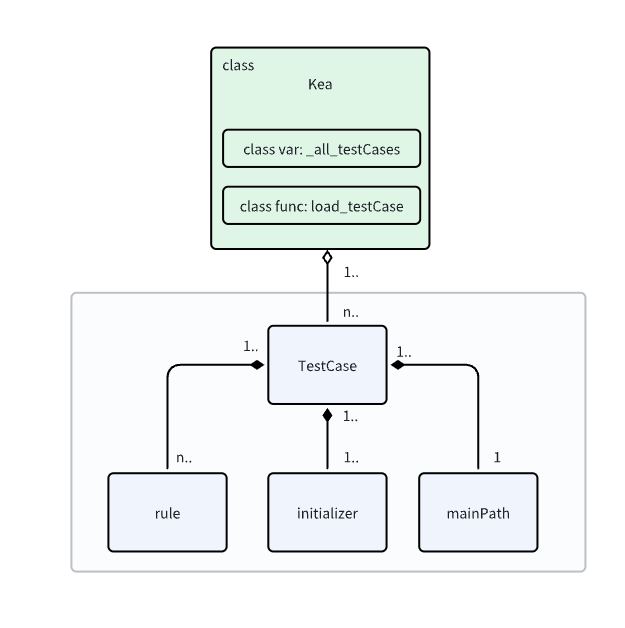

How to write properties
================================

In this tutorial, you will learn how to write properties and test them with Kea.

In mobile apps, a property defines the expected behavior of the app. 
Then, if the app violates the property, it means a bug is found.

At high level, a property consists of three key components **<P, I, Q>**, where (1) *P* is a precondition, 
(2) *I* is an interaction scenario which defines how to perform the app functionality, 
and (3) *Q* is a postcondition which defines the expected behavior.

Kea uses ``@initializer()`` to pass the welcome page or the login page of the app.

In Kea, a property is defined by applying the ``@rule()`` decorator on a function.

To define the precondition of the property, you can use the ``@precondition()`` decorator on the  ``@rule()``-decorated function.

The postcondition is defined by the ``assert`` statement in the ``@rule()``-decorated function.

For mobile apps, you may can get properties from multiple sources, such as the app's specification, the app's documentation, the app's test cases, the app's bug reports, etc.

Let's start with a simple example on how to get a property, write the property in Kea, and test the property by Kea.

Specify property from historical bugs
---------------------------------------------

This example will show how to get a property from the app `OmniNotes <https://github.com/federicoiosue/Omni-Notes/>`_

`OmniNotes <https://github.com/federicoiosue/Omni-Notes/>`_ is an app for taking and managing notes.

Here is a bug report from the app `#634 <https://github.com/federicoiosue/Omni-Notes/issues/634>`_, where a user complained that when he removed a tag, it removed other tags that sharing the same prefix.

Then, from this bug report, you can get a property:

After removing the tag, the tag should be successfully removed and the note content should remain unchanged.

From the bug report, you can get a property as follows:

- **P (Precondition)**: The tag exists.
- **I (Interaction scenario)**: Remove the note tag from the tag list.
- **Q (Postcondition)**: The tag is removed and the note content remains unchanged.

Let's write the property in Kea.

.. code-block:: Python

    @precondition(lambda self: d(resourceId="it.feio.android.omninotes:id/menu_tag").exists() and
                   "#" in d(resourceId="it.feio.android.omninotes:id/detail_content").info["text"]
                   )
    @rule()
    def rule_remove_tag_from_note_shouldnot_affect_content(self):
        # get the text from the note's content
        origin_content = d(resourceId="it.feio.android.omninotes:id/detail_content").info["text"]
        # click to open the tag list
        d(resourceId="it.feio.android.omninotes:id/menu_tag").click()
        # select a tag to remove
        selected_tag = random.choice(d(className="android.widget.CheckBox",checked=True))
        select_tag_name = "#"+ selected_tag.right(resourceId="it.feio.android.omninotes:id/md_title").info["text"].split(" ")[0]
        selected_tag.click()
        # click to uncheck the selected tag
        d(text="OK").click()
        # get the updated content after removing the tag
        new_content = d(resourceId="it.feio.android.omninotes:id/detail_content").info["text"].strip().replace("Content", "")
        # get the expected content after removing the tag
        origin_content_exlude_tag = origin_content.replace(select_tag_name, "").strip()
        # the tag should be removed in the content and the updated content should be the same as the expected content
        assert not d(textContains=select_tag_name).exists() and new_content == origin_content_exlude_tag

The ``@precondition`` decorator defines when the property should be tested.
Here, ``d(resourceId="it.feio.android.omninotes:id/menu_tag").exists()`` checks if the tag button exists and 
``"#" in d(resourceId="it.feio.android.omninotes:id/detail_content").info["text"]`` checks if the note content contains a tag. 

The ``@rule()`` decorator defines the property.
Here, the interaction scenario is to remove a tag.

The postcondition is defined by the ``assert`` statement.
Here, Kea checks if the tag is removed and content remains unchanged.

That's it! This is a property that should be held by `OmniNotes <https://github.com/federicoiosue/Omni-Notes/>`_.

Also, you can add a function to set up the app's initial state before testing the property.

To do this, you can use ``@initializer()`` to specify a function and write the corresponding UI events to pass the welcome page:

.. code:: Python

    @initializer()
    def set_up(self):
        for _ in range(5):
            d(resourceId="it.feio.android.omninotes:id/next").click()
        d(resourceId="it.feio.android.omninotes:id/done").click()
        if d(text="OK").exists():
            d(text="OK").click()

Here, the code can automatically pass the welcome page in `OmniNotes <https://github.com/federicoiosue/Omni-Notes/>`_.
Note that you can use the ``@initializer()`` decorator to define the setup function.
Then, Kea will execute the setup function before testing the property.

.. note::

    This feature can be used to set up the app's initial state before testing the property. 
    For example, use this feature to pass the login, add data to the app, etc.
    If you don't need to set up the app's initial state, you can skip it.

Moreover, if you want to use the main path guided exploration strategy, you should set a main path function.

To do this, you can use the following code:

.. code:: Python

    @mainPath()
    def test_main(self):
        d(resourceId="it.feio.android.omninotes.alpha:id/fab_expand_menu_button").long_click()
        d(resourceId="it.feio.android.omninotes.alpha:id/detail_content").click()
        d(resourceId="it.feio.android.omninotes.alpha:id/detail_content").set_text("read a book #Tag1")
        d(description="drawer open").click()
        d(resourceId="it.feio.android.omninotes.alpha:id/note_content").click()

The code above can guide Kea to create a note with the content of "read a book #Tag1" in the omninotes.

.. note::

    In the part of the definition of the main path, you can only use UI operation commands to complete the definition;
    The function doesn't support for containing other Python statements such as for loops.
    But we believe this approach is sufficient to implement the functionality of the main path.

Here, you have already learned how to write a property in Kea.

To test this property, you need to put the property in a class, which inherits from the ``KeaTest`` class.

.. code:: Python
    
    from kea.main import *

    class Test(KeaTest):
        

        @initialize()
        def set_up(self):
            for _ in range(5):
                d(resourceId="it.feio.android.omninotes:id/next").click()
            d(resourceId="it.feio.android.omninotes:id/done").click()
            if d(text="OK").exists():
                d(text="OK").click()

        @mainPath()
        def test_main(self):
            d(resourceId="it.feio.android.omninotes.alpha:id/fab_expand_menu_button").long_click()
            d(resourceId="it.feio.android.omninotes.alpha:id/detail_content").click()
            d(resourceId="it.feio.android.omninotes.alpha:id/detail_content").set_text("read a book #Tag1")
            d(description="drawer open").click()
            d(resourceId="it.feio.android.omninotes.alpha:id/note_content").click()

        @precondition(lambda self: d(resourceId="it.feio.android.omninotes:id/menu_tag").exists() and
                    "#" in d(resourceId="it.feio.android.omninotes:id/detail_content").info["text"]
                    )
        @rule()
        def rule_remove_tag_from_note_shouldnot_affect_content(self):
            # get the text from the note's content
            origin_content = d(resourceId="it.feio.android.omninotes:id/detail_content").info["text"]
            # click to open the tag list
            d(resourceId="it.feio.android.omninotes:id/menu_tag").click()
            # select a tag to remove
            selected_tag = random.choice(d(className="android.widget.CheckBox",checked=True))
            select_tag_name = "#"+ selected_tag.right(resourceId="it.feio.android.omninotes:id/md_title").info["text"].split(" ")[0]
            selected_tag.click()
            # click to uncheck the selected tag
            d(text="OK").click()
            # get the updated content after removing the tag
            new_content = d(resourceId="it.feio.android.omninotes:id/detail_content").info["text"].strip().replace("Content", "")
            # get the expected content after removing the tag
            origin_content_exlude_tag = origin_content.replace(select_tag_name, "").strip()
            # the tag should be removed in the content and the updated content should be the same as the expected content
            assert not d(textContains=select_tag_name).exists() and new_content == origin_content_exlude_tag

Here, you need to write the property in the ``Test`` class, which inherits from the ``Kea`` class.

We put this file example_mainpath_property.py in the ``example`` directory.
You can test the property by running the following command:

.. code:: console

    kea -f example/example_mainpath_property.py -a example/omninotes.apk

When you try to test this property, you may quickly find two new bugs that violates this property.
Then, you can write the corresponding bug reports and submit them to the app's developers.
Both of them are fixed by app developers.

You can see the bug reports:

1. `Bug Report: Note tag cannot be removed <https://github.com/federicoiosue/Omni-Notes/issues/942>`_.

2. `Bug Report: Deleting One Tag in a Note Affects Another Tag in the Same Note <https://github.com/federicoiosue/Omni-Notes/issues/949>`_.

Specify property from app function
---------------------------------------------
This example will show how to get a property from the app `Amaze <https://github.com/TeamAmaze/AmazeFileManager>`_

`Amaze <https://github.com/TeamAmaze/AmazeFileManager>`_ is an app for file management.
It provides a simple and intuitive user interface that allows users to easily browse, manage, and manipulate files.

In the Amaze, you can create a folder and after your creation the new folder should exist. So you may can define a property
``create_folder_should_exist``. Just means when you want to create a folder, it should works.

You also need to use ``@rule()`` and ``@precondition()`` to define the property.
Here, the precondition *P* is the creating folder button is on the current interface, and the current interface allow to ctrate folder.
And then *I* is executing some events to create the folder.
Finally, *Q* is to check whether the new folder is created successfully.

.. code:: Python

    @precondition(lambda self: d(resourceId="com.amaze.filemanager:id/sd_main_fab").exists() and
                               not d(textContains = "SDCARD").exists())
    @rule()
    def create_folder_should_exist(self):
        d(resourceId="com.amaze.filemanager:id/sd_main_fab").click()
        d(resourceId="com.amaze.filemanager:id/sd_label", text="Folder").click()
        file_name = self._files.get_random_value()
        d.send_keys(file_name, clear=True)
        d(resourceId="com.amaze.filemanager:id/md_buttonDefaultPositive").click()
        d(scrollable=True).scroll.to(resourceId="com.amaze.filemanager:id/firstline", text=file_name)
        assert d(text=file_name).exists()

That's it! You have learned how to write a property from an app function.

.. note::

    You can write a property or some properties in one ``.py`` file as one TestCase, of course, you can also write multiple properties in multiple ``.py`` files.
    But if you choose the first method you should make sure there is at most one ``@initializer()`` and at most one ``@mainPath()`` in a ``.py`` file, but
    you can have multiple ``@rule()`` and ``@precondition()``. The structure of TestCase is in the image below.

|